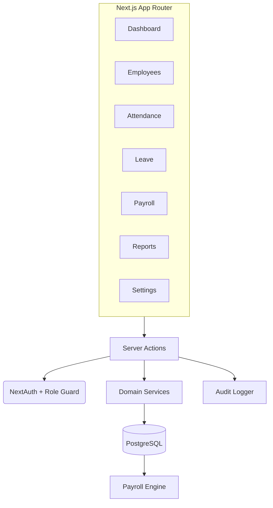

# HRMS Suite — Employee, Payroll & Leave Management

A single-company web application for **employee records**, **attendance**, **leave management**, and **Indian payroll** with statutory deductions (PF, ESI, PT, TDS).

## Tech Stack

- **Next.js 16** (App Router, Server Actions)
- **PostgreSQL** + **Prisma ORM**
- **NextAuth** (Credentials auth, role-based access)
- **Tailwind CSS** + shadcn/ui-style components
- **Vitest** for unit tests (payroll engine)

## Quick Start

### 1. Start PostgreSQL

```bash
docker compose up -d
```

### 2. Configure environment

```bash
cp .env.example .env
# Edit .env if needed (defaults work with docker-compose)
```

### 3. Install & migrate

```bash
npm install
npx prisma migrate dev --name init
npm run db:seed
```

### 4. Run dev server

```bash
npm run dev
```

Open [http://localhost:3000](http://localhost:3000)

### Demo Credentials

| Role     | Email            | Password    |
|----------|------------------|-------------|
| Admin    | admin@demo.com   | admin123    |
| Employee | rahul@demo.com   | employee123 |

## Features

### Phase 0 — Bootstrap ✅
- Next.js + Tailwind + shadcn/ui scaffolding
- Prisma schema with all entities
- NextAuth credentials login with ADMIN/EMPLOYEE roles
- Sidebar layout with light/dark theme
- Docker Compose for PostgreSQL

### Phase 1 — Core Entities ✅
- Company settings (PF/ESI/PAN, statutory config)
- Employee CRUD with bank & statutory fields
- Salary component management per employee
- Seed script with demo data

### Phase 2 — Leave Management ✅
- Leave policies per employee type
- Leave balance initialization with carryover
- Employee leave requests (self-service)
- Admin approve/reject workflow
- Company holiday calendar

### Phase 3 — Attendance ✅
- Employee punch in/out (web)
- Admin attendance table
- Month-end closing (LOP derivation, weekends/holidays)

### Phase 4 — Payroll Engine ✅
- Monthly gross from salary components (pro-rata)
- PF (12%, capped), ESI (threshold-based), PT slabs, TDS (old/new regime)
- Unit tests for payroll calculations

### Phase 5 — Payroll Workflow ✅
- Open pay run → prefill all employees
- Review → Lock → Finalize state machine
- Bank CSV and PF challan export

### Phase 6 — Reporting & Audit ✅
- Dashboard with key metrics
- Audit log viewer
- Monthly payroll summary reports
- RBAC guards on all pages

## Architecture



## Scripts

| Command           | Description                |
|-------------------|----------------------------|
| `npm run dev`     | Start development server   |
| `npm run build`   | Production build           |
| `npm run db:migrate` | Run Prisma migrations   |
| `npm run db:seed` | Seed demo data             |
| `npm run test`    | Run unit tests             |

## Key Design Decisions

- **Currency**: All amounts stored as integer paise (avoid float errors)
- **Immutability**: Finalized pay runs freeze payslip snapshots
- **RBAC**: Role guards in every server action
- **Audit**: Append-only log on all mutations
- **Statutory rates**: Configurable via `StatutoryConfig`, never hard-coded

## Project Structure

```
src/
├── app/
│   ├── (app)/          # Authenticated routes
│   │   ├── dashboard/
│   │   ├── employees/
│   │   ├── attendance/
│   │   ├── leave/
│   │   ├── payroll/
│   │   ├── reports/
│   │   ├── settings/
│   │   └── audit/
│   └── login/
├── components/         # UI components
├── lib/
│   ├── actions/        # Server actions
│   └── services/       # Payroll engine, etc.
└── auth.ts             # NextAuth config
prisma/
├── schema.prisma       # Full data model
└── seed.ts             # Demo data
```
