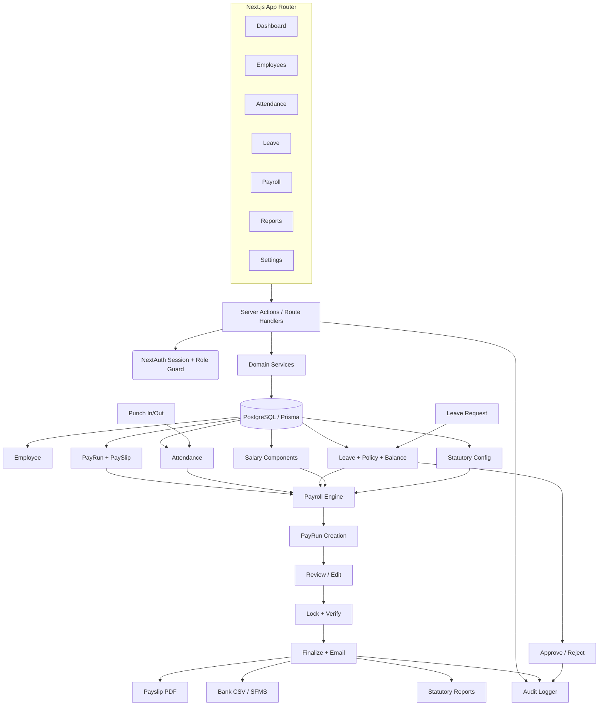

# Architecture

See the main [README](../README.md) for setup instructions.

## Data Flow



## Pay Run State Machine

```
DRAFT → REVIEWING → LOCKED → FINALIZED
  ↓         ↓
CANCELLED  DRAFT (reopen)
```

## Money Handling

All monetary values are stored as **integer paise** (1 INR = 100 paise).
Rounding follows half-up to the nearest rupee at display time only.
